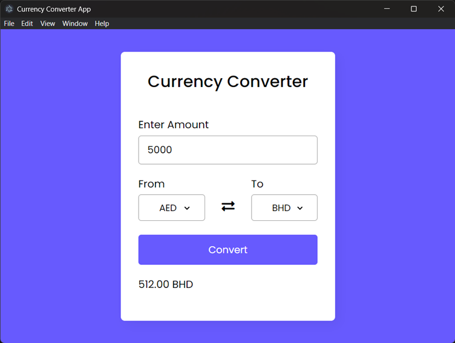
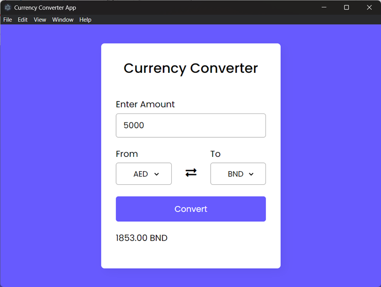

# Currency Convertor App In Electron.Js With ExchangeRate API

The Currency Converter App is developed using Electron.js, which facilitates quick and accurate currency conversions. By integrating with the ExchangeRate API, the app ensures real-time access to the latest exchange rates from a trusted source. The intuitive user interface makes it effortless for users to select their desired source and target currencies, input the amount, and get the converted value within moments. Leveraging Electron's robust capabilities, the application offers a native desktop experience across different operating systems, ensuring consistent performance and responsiveness.


## Installation

Step 1 : clone this repository

```bash
  git clone https://github.com/shrinivas-baldawa/Currency-Convertor-App.git
  cd Currency-Convertor-App
```

Step 2 : Install all the required libraries

```bash
    npm install
```

Step 3 : After installing all the required libraries

``` bash
    npm start
```
And the project will start in a new window.
    
## Environment Variables

To run this project, you will need to add your own api key in the renderer.js file in the API_URL variable.


## Screenshots

